# 软件工程之美

> 感觉宝玉的软件工程之美 如果想要了解完整资料，可以去极客时间购买 专栏。
> 此书仅做个人笔记使用

## 项目生命周期

1. 规划
2. 需求分析
3. 设计
4. 编码
5. 测试
6. 运行和维护

## 软件项目管理金三角

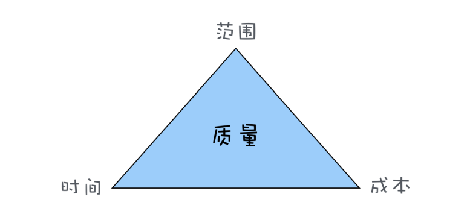

1. 时间
2. 范围
3. 成本

## [全面提升软件工程能力与实践，打造可信的高质量产品](https://xinsheng.huawei.com/cn/index.php?app=forum&mod=Detail&act=index&id=4134815)

## 软件工程的核心

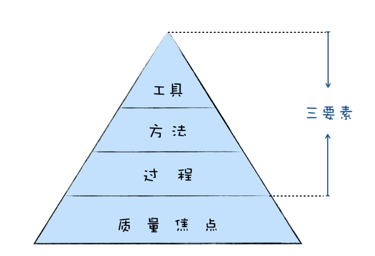

```
软件工程 =   工具 + 方法 + 过程
```

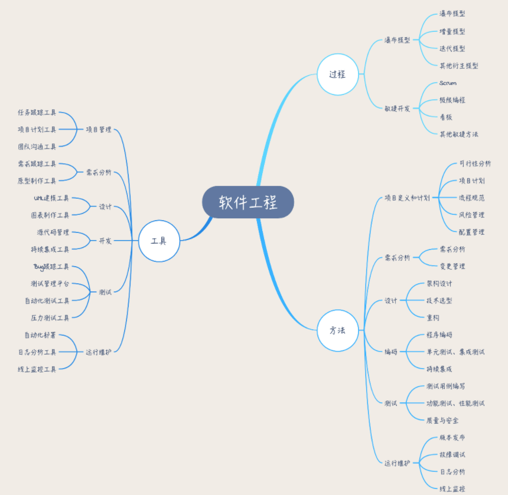

### 做中学 和 教中学

## 推荐配套书单

1. 构建法

   作者邹欣是微软的研发总监，同时在多所高校进行了软件工程的教学实践，在此基础上对软 件工程的各个知识点和技能要求进行了系统性整理，形成教材。也是本专栏很多很好的补 充。

2. 人月神话

   这是软件工程历史上的经典著作，内容发人深省，40 年来一直畅销不衰，里面的观点即使 到现在也不过时。这本书即使你以前看过，隔一段时间再翻看一遍，可能都会有新的感悟。

3. 人件

   如果说《人月神话》关注“软件开发”本身，《人件》则关注软件开发中的“人”。作者指 出知识型企业的核心是人，而不是技术。

4. 知行合一： 实现价值驱动的敏捷和精益开发

   作者丛斌有二十多年从事软件工程教学、咨询和研究的经验，所以书写的特别接地气，文章 有很多真实案例，对敏捷开发和 CMMI 都有很深入描述。

5. 软件工程——实践者的研究方法》

   这是大部分高校采用的软件工程标准教材，可以作为一个参考。

6. 持续交付

   讲述如何实现更快、更可靠、低成本的自动化软件交付，描述了如何通过增加反馈，并改进 开发人员、测试人员、运维人员和项目经理之间的协作来达到这个目标

7. 走出软件作坊

   这本书生动的描述了国内小型 IT 企业在发展过程中遇到的一系列项目管理问题，以及作者 是如何去解决这些问题的。

## 瀑布模型和敏捷开发如何平衡时间成本范围的关系？

### 瀑布模型

瀑布模型有严格的阶段划分，有需求分析、系统设计、开发和测试等阶段，通常在开发过程 中**不接受需求变更**，也就是说，我们可以认为**瀑布模型的范围是固定的**，其他两条边时间和 成本是变量。

所以使用瀑布模型开发，如果中间发现不能如期完成进度，通常选择的方案就是延期（加 班），或者往项目中加人。

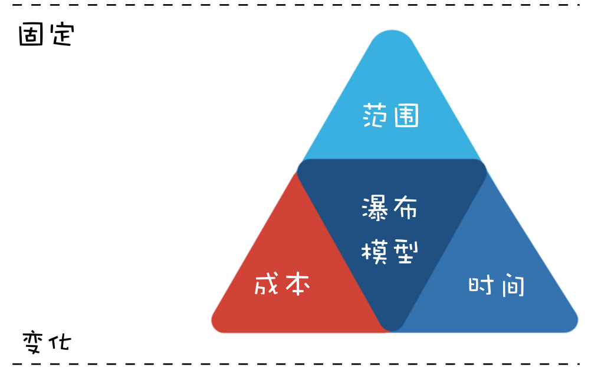

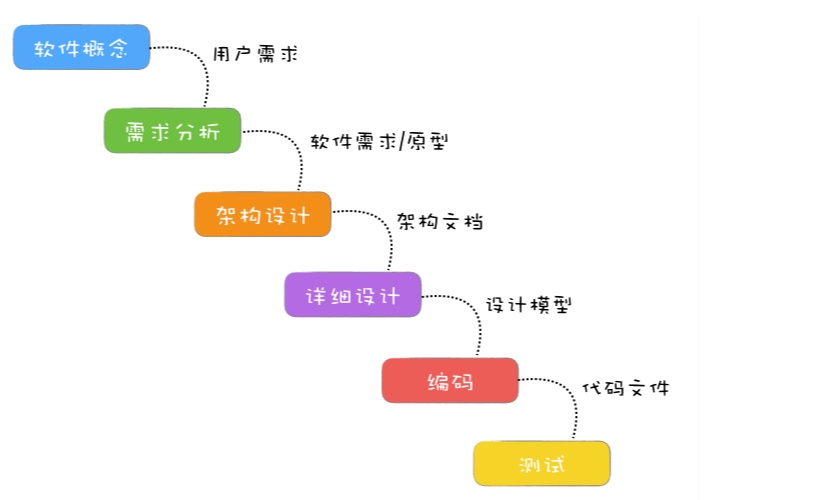

然而瀑布的特性决定了它只能从上往下流，而且从上到下走完整个周期很长，所以一旦出现了需求的变更，将会非常痛苦，很多事情需要重头再来。

于是基于瀑布模型，又衍生出 V 模型、原型设计、增量模型、螺旋模型等模型，试图改善瀑布模型存在的一些缺陷。这些改进模型的发展趋势上就是缩短项目周期，快速迭代

### 敏捷开发

我们再来看敏捷开发，敏捷开发中，是采用**固定时间周期**的开发模式，例如每两周一个 Sprint，团队人数也比较少。所以，在敏捷开发中，**时间和成本**两条边是固定，就只有范围 这条边是变量。

这就是为什么在敏捷开发中，每个 Sprint（迭代） 开始前都要开 Sprint 计划会，大家一起选择下个 Sprint 能做完的任务，甚至于在 Sprint 结束时，没能完成的任务会放到下个 Sprint 再 做。

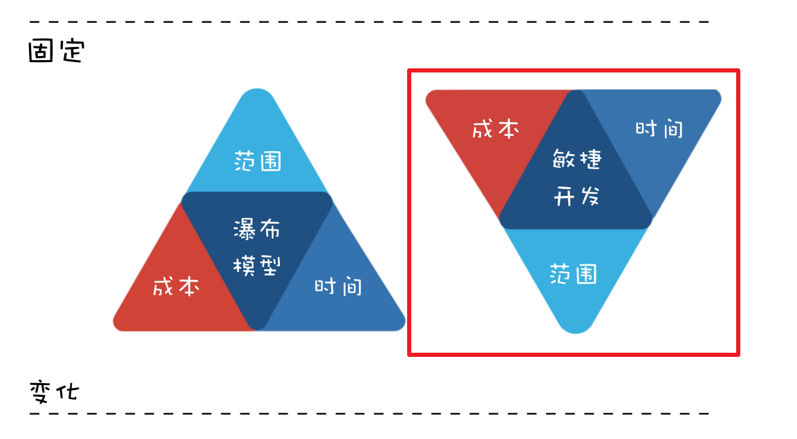

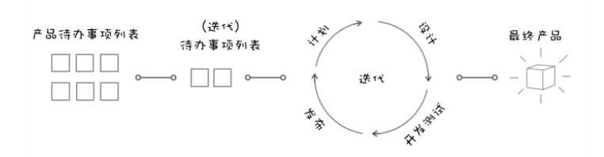

## 极限编程

如果某个实践好，就将某个实践做到极致

1. 如果做测试好，就让每个开发人员都做测试 ;
2. 如果集成测试重要，就每天都做几次测试和集成 ;
3. 如果简单的就是好，那么我们就尽可能的选择简单的方法实现系统功能 ;

## 工程方法

**有目的、有计划、有步骤地解决问题的方法就是工程方法。**工程方法不是软件工程独有的，几乎所有工程类别都可能会应用，例如建筑工程、电子工程等，只不过步骤可能略有不同

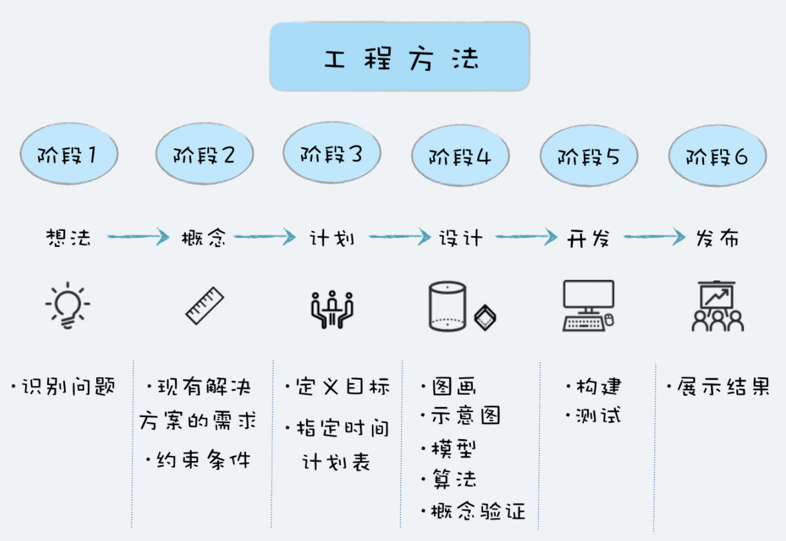

## 瀑布模型 (6 个阶段)

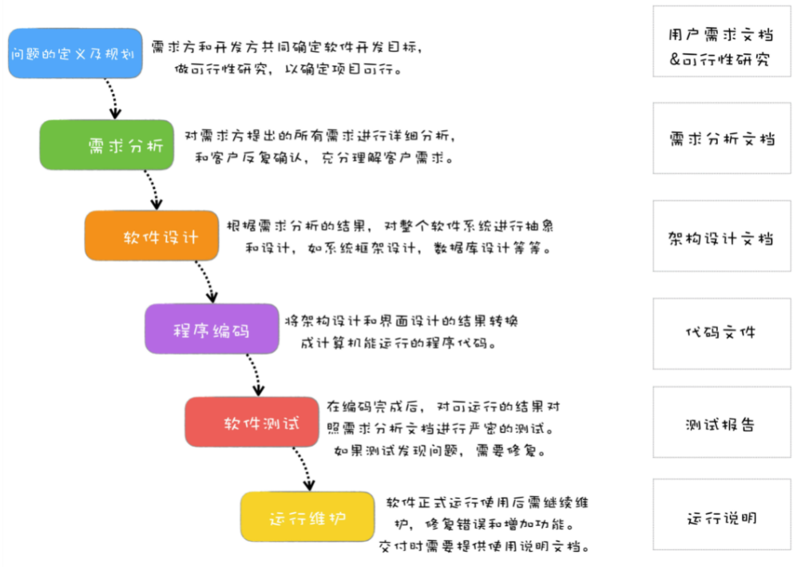

### 一、问题的定义及规划

这个阶段是需求方和开发方共同确定软件开发目标，同时还要做可行性研究，以确定项目可行。这个阶段会**产生需求文档和可行性研究报告**。

### 二、需求分析

对需求方提出的所有需求，进行详细的分析。这个阶段一般需要和客户**反复确认**，以保证能充分理解客户需求。最终会形成需求分析文档。

### 三、软件设计

根据需求分析的结果，对整个软件系统进行抽象和设计，如**系统框架设计，数据库设计**等等。最后会形成架**构设计文档。**

### 四、程序编码

将架构设计和界面设计的结果转换成计算机能运行的程序代码。

### 五、软件测试

在编码完成后，对可运行的结果对照需求分析文档进行严密的测试。如果测试发现问题，需要修复。最终测试完成后，形成**测试报告**。

### 六、运行维护

在软件开发完成，正式运行投入使用。后续需要继续维护，修复错误和增加功能。交付时需要提供使用说明文档。

瀑布模型在提出后，因为其简单可行，切实有效，马上就在很多软件项目中应用起来，一直到 2000 年前后，都是最主流的软件开发模型，即使到现在，你也能在很多软件项目中看到它的影子

**也是从那时开始，有了“软件生命周期”(Software Life Cycle,SLC) 的概念。**

> 软件生命周期是软件的产生直到报废或停止使用的生命周期。而像瀑布模型这样，通过把整个软件生命周期划分为若干阶段来管理软件开发过程的方法，叫软件生命周期模型。

### 优缺点

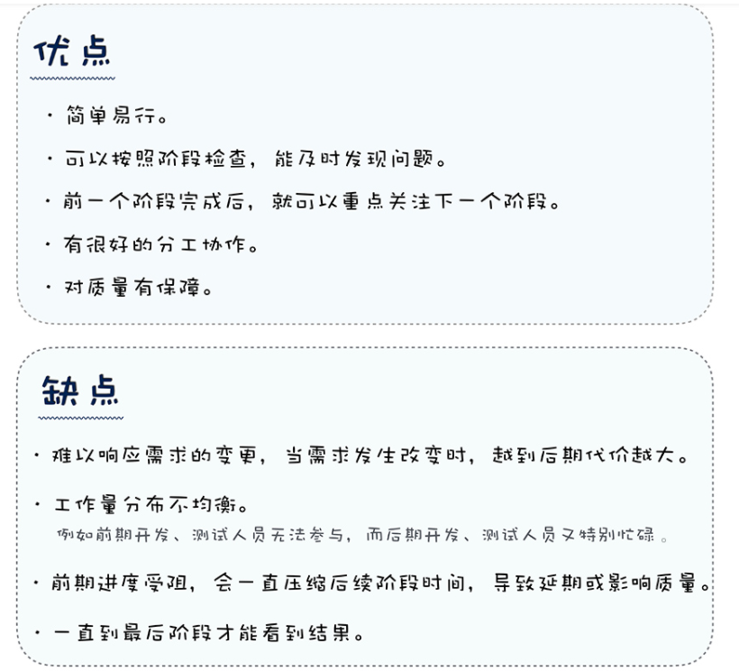

### Code And Fix 边写边改 模型 😄

## 快速开发快速改

### 快速原型模型

**快速原型模型，就是为了要解决客户的需求不明确和需求多变的问题**,**快速原型开发往往是以牺牲质量为代价的**

针对原型模型的这种快速、低质量的特点，通常有两种处理策略：**抛弃策略和附加策略。**

### 大瀑布拆小瀑布

**瀑布模型的很多问题，根源都是周期太长。**周期长所以中间难以响应变更，周期长所以客户很久才能看到结果，周期太长所以风险不好控制。如果能将周期变短，那么很多问题就迎刃而解了。

基于这种思路，产生了很多开发模型，比较典型的主要是：**增量模型** 和 **迭代模型**

#### **增量模型——按模块分批次交付**

**增量模型是按照功能模块来拆分；而迭代模型则是按照时间来拆分，看单位时间内能完成多少功能**

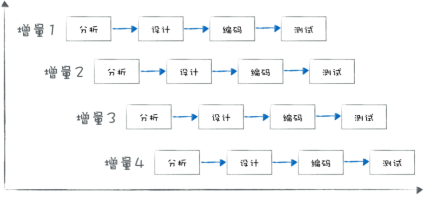

因为增量模型的根基是模块化，所以，**如果系统不能模块化，那么将很难采用增量模型的模式来开发。**另外，对模块的划分很抽象，这本身对于系统架构的水平是要求很高的。

基于这样的特点，增量模型主要适用于：**需求比较清楚，能模块化的软件系统，并且可以按模块分批次交付。**

#### **迭代模型——每次迭代都有一个可用的版本**

在一个迭代中都会包括需求分析、设计、实现和测试，类似于一个小瀑布模型。**迭代结束时要完成一个可以运行的交付版本**

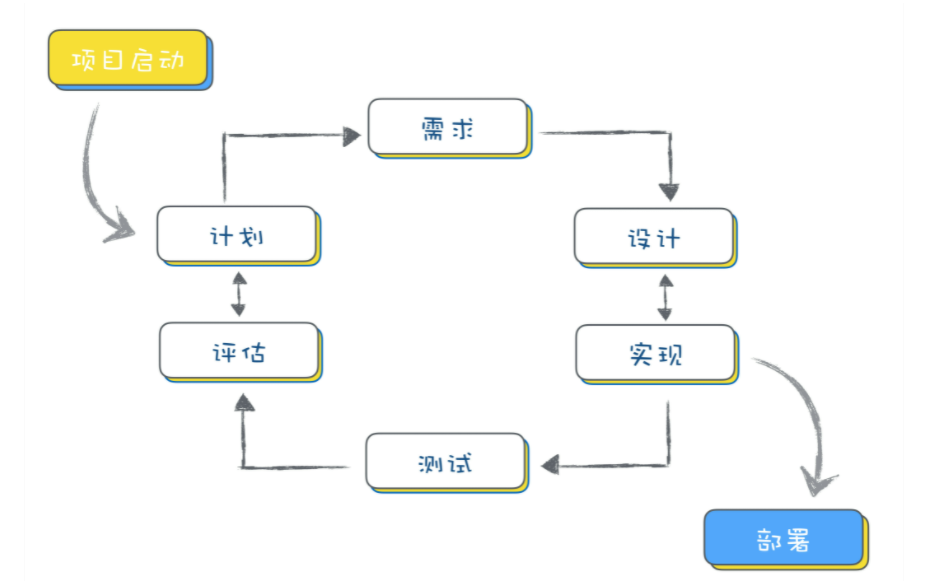

**迭代模型最难的部分，在于规划每次迭代的内容和要达到的目标**

#### 小结

- 一个以确认需求为主要目的的项目，就可以不用花太多时间在代码质量上面，低成本、高效做出来才是最重要的；
- 一个高风险的项目，则可以采用螺旋模型，出现问题及时止损；
- 一个很长时间加班加点，却一直没法上线，导致士气低落的项目，可以改成增量模型，先上线一个小模块，让大家看到成绩提升士气，然后再迭代，逐步上线其他模块。

## 敏捷开发

**瀑布模型的典型问题就是周期长、发布烦、变更难，敏捷开发就是快速迭代、持续集成、拥抱变化**

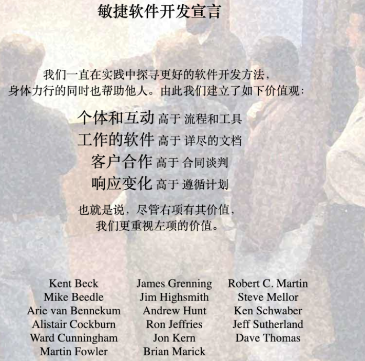

**当你开发做决策的时候，遵守了敏捷开发的价值观和原则，不管你是不是用 Scrum 或者极限编程，那么都可以算是敏捷开发**

采用敏捷开发的模式也存在一些问题，例如全程需要客户参与，由于测试相对少一些 ，问题也会相应多一些

瀑布模型面向的是过程，而敏捷开发面向的是人

### 该不该选择敏捷开发？

该不该选择敏捷开发，是很多团队纠结的问题。毕竟关于敏捷，有很多在中国落地失败的例子，是不是这种方法在国内水土不服？

其实，敏捷开发无论国内还是国外，大厂还是小厂，都已经有无数成功案例。这些年，软件工程中一些好的实践，像持续集成、测试驱动开发、结对编程、看板等都来自于敏捷开发。可以肯定，敏捷开发是一种非常好的软件开发模式。

但在应用上，也确实需要一些满足一些条件才能用好，例如：

- **团队要小**，人数超过一定规模就要分拆；
- **团队成员之间要紧密协作，客户也要自始至终深度配**合；
- **领导们得支持。敏捷需要扁平化的组织结构，更少的控制，更多的发挥项目组成员的主动性**；
- 写代码时要有一定比例的**自动化测试代码**，要花时间搭建好源码管理和持续集成环境。

所以在选择敏捷开发这个问题上，你先要参考上面这些条件。

因为敏捷开发对项目成员综合素质要求更高，做计划要相对难一些。如果团队大、客户不配合、领导不支持，再好的敏捷方法也很难有效实践起来。

如果你要实践敏捷开发，建议先找个小项目进行试点，能证明可行了，再进一步推广。有条件的话，可以和一些顾问公司合作，请人做专门的培训和指导。

如果不具备条件，应该考虑先把其中一些好的实践用起来，比如说持续集成、每日站会、自动化测试等。

### 大厂使用敏捷开发

工程中常见的“分而治之”的策略：**大项目拆成小项目，大服务拆成小服务，大团队拆成小团队** 归功于 (微服务、容器等)

cl 持续集成

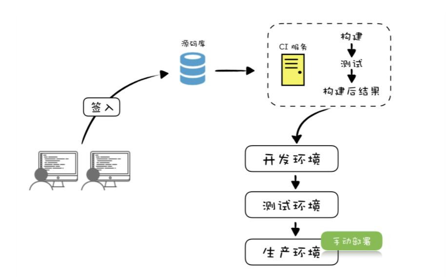

在这里以一个开发任务为例，大致讲解一下应用敏捷开发方法的基本开发流程：

- 把要开发的 Ticket 从“To Do”栏移动到“In Progress”栏；
- 从主干（master）创建一个分支（branch），基于分支去开发功能或修复 Bug；
- 编写实现代码和测试代码（单元测试和集成测试），是不是测试驱动不重要，看个人偏好或团队要求；
- 持续提交代码更新到分支，直到完成；
- 创建 PR（Pull Request，合并请求），邀请其他人帮忙 Review 代码，根据 Review 的结果，可能还需要更新几次；
- CI 在每一次提交代码到代码库后都会自动运行，运行后主要做这些工作：
  – 检查代码格式是不是符合规范；
  – 运行单元测试代码；
  – 运行集成测试。
- 最终这些检查都完成后，CI 会把执行结果显示在 PR 上。通常绿色表示通过，红色表示失败；
- PR 能合并需要满足两个条件：CI 变绿 + 代码 Review 通过；
- PR 合并后，CI 会自动构建 Docker Image，将 Image 部署到开发环境；
- 将相应的 Ticket 从看板上的“In Progress”栏移动到“Done”栏。

### 部署上线流程

这些年随着容器化、微服务、DevOps 这些技术或概念的兴起，部署已经变得越来越高效，大厂已经开始在部署流程上融合这些理念。

- 首先，部署的不再是程序代码，而是 Docker 的 Image，每次代码合并后 CI 都会自动生成新的 Image，测试也是基于 Image 测试。
- 部署生产环境之前，先在内部的测试环境充分测试。
- 部署生产环境前，需要审批确认，有 Ticket 跟踪。
- 部署时，先部署一部分，监测正常后再全量部署。
- 整个过程都有监控报警，出现问题及时回滚。

## 项目管理工具

- 微软 ms project 瀑布流 粗狂

- jira

- azure devops

- github

- 码云

- 禅道

- worktile

- tapd 腾讯

- 运效 啊里

- devcloud 华为

- 基于 Ticket 的任务跟踪系统

  ```
  标题 摘要性描述 ticket内容
  类型 bug、需求、任务等
  内容 详细描述
  创建人 谁创建的
  优先级
  状态 未开始、处理中、已解决、重新打开、关闭
  指派给谁
  历史记录
  其他 创建时间、附件、标签、版本
  ```

- 燃尽图 （burn down chart）

  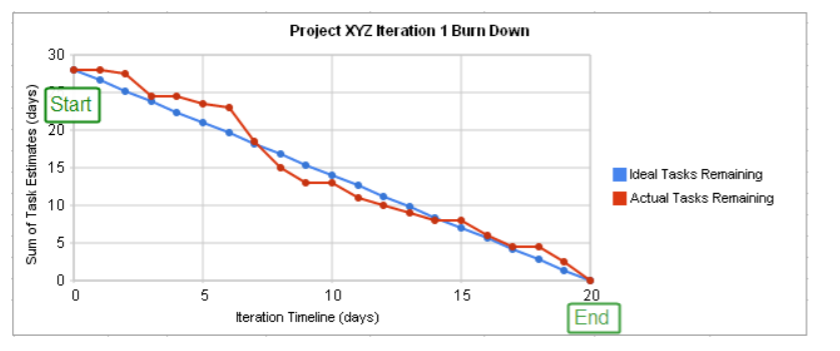

## 风险管理

> 风险 = 损失 \* 发生概率

风险管理就是指在项目进行过程中，识别可能的风险，对风险进行评估，并加以监控，从而减少风险对项目的负面影响。

### 蒋涛 10 个项目死亡的信号：

```
1. 第一版做太多功能 ;
2. 太依赖新技术平台；
3. 与公司另一个有份量的产品竞争；
4. 团队人手不足；
5. 复杂的问题，需要复杂的解法；
6. 成员开始隐藏进度落后的事实和原因；
7. 不断更改、增加的需求 ；
8. 2.0 症候群 - 非要更大、更强、更美 ；
9. 产品没有市场立足点；
10. 你根本无法解决的大问题。
```

### 如何进行风险管理

#### 识别风险 检查表法

- 项目风险：项目预算、进度、用户和需求等方面的问题；
- 人员风险：人员离职、人手不足等问题；
- 技术风险：采用的技术所可能带来的风险；
- 商业风险：与市场、产品策略等有关的商业风险。

### 风险量化，对风险进行评估量化

- 风险发生的规律有多大
- 后果有多严重

### 应对计划，制定策略

- 回避风险 更改方案
- 转移风险 不自己搭建服务器 购买云服务器
- 缓解风险 拼多多 免费领券 添加限制
- 接受风险

### 风险监控 预警

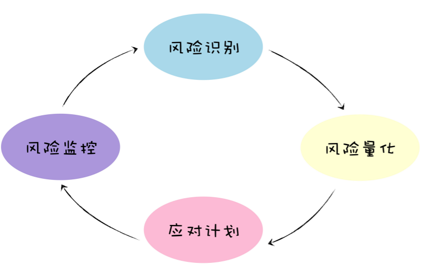

## 怎么做需求分析

单个用户的需求

1. 挖掘真实需求
2. 提出解决方案
3. 筛选和验证方案

软件工程需求

1. 收集需求：对用户需求进行收集整理；
2. 分析需求：对需求进行分析，挖掘用户真实需求；
3. 需求评估：筛选过滤掉不可行的需求；
4. 需求设计：针对用户需求提出解决方案，设计成产品方案；
5. 验证需求：验证方案是否可行

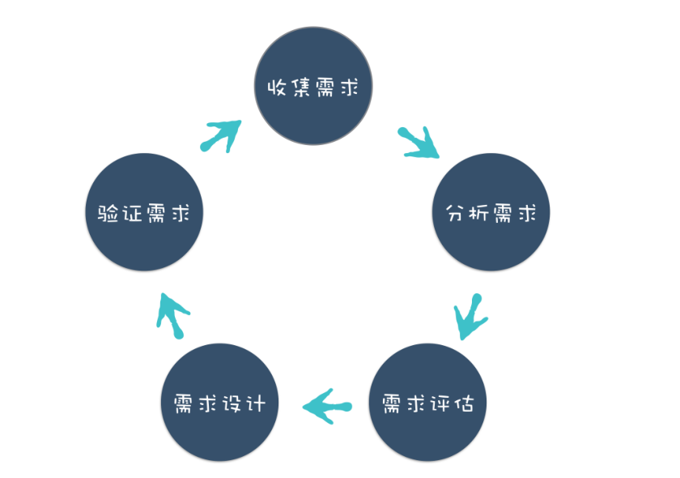

### 收集需求

1. 头脑风暴
2. 用户调研
3. 竞品分析
4. 快速原型

### 分析需求

表层需求：用户对解决问题的期望，例如马车更快

深层需求：用户的深层次动机，诉求产生的原因，例如乘客对出行速度的要求

底层需求：人形本能的需求，例如对安全感对舒适的追求

### 需求评估

需求评估考虑的因素有：

1. 可行性：技术能否实现；
2. 成本：人力成本、时间成本；
3. 商业风险和收益：有没有商业上的风险，收益是否合理；
4. 紧急性与重要性：是不是用户迫切的需求

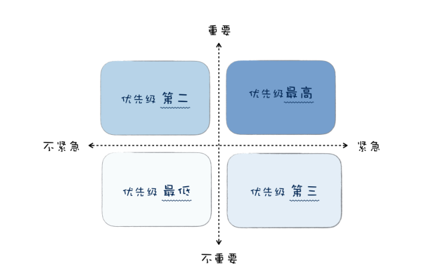

---

或者 **KANO** 模型

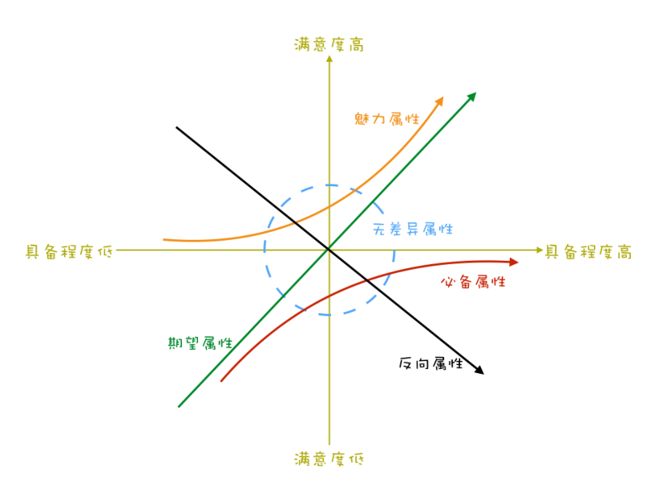

### 需求设计

在分析和评估完需求后，还需要提出解决方案，也就是对需求进行设计，做出来有效的产品。

设计方案。最终的产品设计，会落实到人机交互上面，用户可以通过软件界面交互。

现在产品设计方面，各个平台都有一套比较成熟的界面标准控件，大部分产品设计都可以基

于标准界面控件，组合成满足需求的用户界面，在满足功能的前提尽可能做的易用和美观。

### 验证需求

对需求的验证方式其实是贯穿整个软件项目生命周期的，在需求分析阶段，会反复验证确认

设计好的需求是否满足用户的真实需求，例如各种设计评审。

在产品开发完成后，也需要有需求的验收，以确保开发出来的软件产品是客户想要的，满足

客户需求的。

现在很多互联网产品，还有一种基于数据的验证需求方式，也就是 A/B 测试。

设计好一个功能上线后，并不直接让所有用户使用，而是先给一小部分用户使用，然后分析

数据，看使用这个功能的用户群和不使用这个功能的用户群，在营收、访问量、活跃度等关

键数据上是更好还是更坏。如果好，就加大比例，如果数据不好，可能就会调整甚至取消这

个功能。

我在设计播放器的时候，首先用 PPT 做了一个简单的草图，拿去给老师确认，收集一些反

馈后，写了一个 PC 版的软件原型，拿给一部分同学试用。在收集反馈后，做了一些修改和

调整，最终确认了产品的设计

在需求分析完成后，就可以基于需求分析形成的文档，进行设计和开发了

## 原型设计

### 快速原型模型

1. 静态页面确认
2. 交互过程确认 （有后台，可以响应，但是没有数据库）
3. 接入真正的数据库或者后台服务

**第一阶段确认界面布局和内容**

**第二阶段确认交互**

**第三阶段实现**

对于产品经理来说，要开发人员配合

1. 低保真原型设计 （线框图即可）
2. 中等保真原型设计（axure 即可）
3. 高保真原型设计
   1. 成本较高，一般会和低保真原型配合 低保真原型确认需求，高保真确认确认最后的交互和 UI 设计。

### 如何做好原型设计

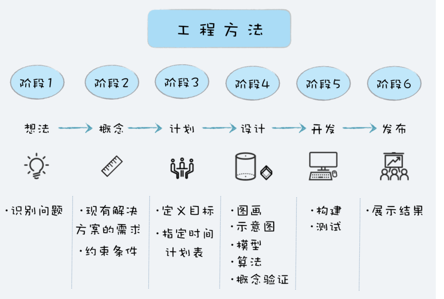

参考工程方法，我们可以将每次原型设计过程分成四个部分：分析、设计、实施和验证。

1. 分析

2. 设计

   **要优先考虑满足产品需求，然后是让界面好看好用**

3. 实施

4. 验证

   自己验证几遍、开评审会议。

原型工具的选中从以下几个纬度来思考

1. 面向的 平台：web、桌面、手机
2. 保真度
3. 功能：是否满足你的需求
4. 成本：价钱

- Axure RP：Axure RP 曾一度是原型设计工具的代名词，历史悠久功能强大，可以制作网
  站、桌面软件、移动 App 的原型。 缺点是专业度较高，价格高。
- 墨刀：墨刀 是一款优秀的国产原型设计工具，可以制作网站、桌面软件、移动 App 的原
  型。上手相对容易，价钱也较 Axure 便宜很多。
- Adobe XD：Adobe XD 是 Adebe 出的一款设计兼原型设计工具，可以制作出高保真原
  型，对于设计师尤其容易上手。
- ProtoPie：ProtoPie 是一款高保真原型设计工具，不需要编程基础，可以做出逼真强大的
  交互效果。
- Framer X：Framer X 是一款高保真的原型设计工具，功能很强大，但是需要一定的编程基
  础，尤其适合程序员使用

## 程序员应该要懂产品

程序员的价值 不都是技术水平越高、价值就越大。而是和你创造的价值是正相关

- 价值体现在你做的产品之上

- 价值体现在团队中的稀缺性

  有的程序员能搞定别人搞不定的技术难题；

  有的程序员擅长培训新人；

  有的程序员擅长和业务部门沟通；

  有的程序员能高质量地完成功能模块；

  有的程序员能按照需求设计好的架构，可以让团队高效率低成本地完成需求。

### 什么是产品意识

产品意识，本质就是一种思维方式，一种站在产品角度思考问题的方式。如果细分一下，产

品意识包含：**商业意识**、**用户意识**和**数据意识**。

#### 商业意识

所做的产品要有商业价值。

成本意识

商业意识的另一方面其实是成本，成本意识也是程序员容易忽视的。比如说：

有时候为了炫技，采用了更难更酷的技术方案，而忽视了所采用的方案会导致很高的开发
成本；

花了太长时间去开会而忽略了开会的成本；

有时候又为了省钱，舍不得买一些成熟的商业组件或服务，反而是浪费了更多成本。

如果程序员有商业意识，就可以在项目中有更好的成本意识，为**项目节约时间**、经济等成

本，帮助团队打造更有价值的产品

#### 用户意识

所谓用户意识，就是说做产品时，你要能挖掘出用户的真实需求，让产品有好的用户体验。

这需要你要有同理心，能站在用户的角度去思考和体验产品。

**大部分程序员可能更多专注于程序上，所以在用户意识上确实有所欠缺。举例来说**

- 一个产品功能，产品经理在细节上没有定义清楚，程序员可能并不会主动提出，最终做出

  来的产品会不好用；

- 在做技术方案时，更追求技术炫酷，而不是用户体验更好；

- 在设计接口时，并没有考虑调用者的便利性

#### 数据意识

所谓数据意识，就是在产品设计、产品运营时，通过数据来发现问题、证实结果

## 如何应对需求变更

根据不同阶段选择合适的方案

- 提升需求确定性
- 提高需求变更的成本
- 降低响应需求变更的成本

## 架构设计

- 分析需求；
- 选择相似的成熟的架构设计方案；
- 自顶向下层层细化；
- 验证和优化架构设计方案

推荐书籍

- [架构整洁之道](https://book.douban.com/subject/30333919/)
- [以“前浪微博”场景为例，谈谈架构设计流程四步曲](https://www.infoq.cn/article/architecture-design-process)
- [从单个服务器扩展到百万用户的系统](https://mp.weixin.qq.com/s/wSCeO8QVYniMIGcBFDZyjw?)
- [架构师之路](https://www.w3cschool.cn/architectroad/)
- [软件架构入门](http://www.ruanyifeng.com/blog/2016/09/software-architecture.html)

### 什么是架构师思维

- 抽象

  在软件项目中，遇到类似的场景，就会考虑抽象出来，总结一个规则和方法

- 分治

  架构设计的一个重点，就是要对复杂系统分而治之，分解成小的、简单的部分。但光分解还

  是不够的，同时还需要保证分解后的部分能够通过约定好的协议集成在一起

- 复用

  复用是一种非常简单有效的提升开发效率的方法，通过对相同内容的抽象，让其能复用于不

  同的场景

- 迭代

  好的架构设计，通常不是一步到位，而是先满足好当前业务需求，然后随着业务的变化而逐

  步演进

一个好的架构师，不仅技术要好，还要懂业务；能从整体设计架构，也能在局部实现功

所以要成为好的架构师，需要具备几个条件。

1. 有架构师思维：具备良好的抽象思维、分治思维、复用思维和迭代思维

2. 懂业务需求：能很好地理解业务需求，能针对业务特点设计好的架构；

3. 有丰富的编码经验：像抽象、分治、复用这些能力，都需要大量的编码练习才能掌握；

另外保持一定量的编码经验也有助于验证架构设计；

4. 良好的沟通能力：架构师需要沟通确认需求，需要让团队理解架构设计

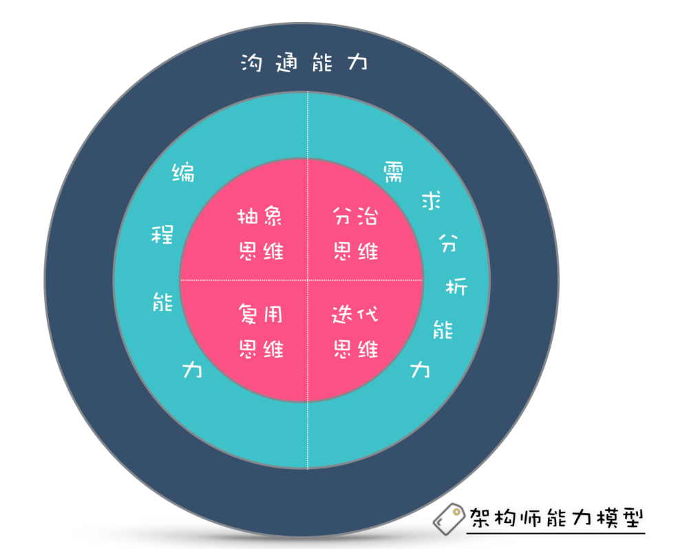

### 如何成为好的架构师

要成为好的架构师，没有什么捷径，需要比普通程序员更多的努力才行

如果你有志向成,为架构师的话，我的建议是：

技术好是成为架构师的基础条件。需要让你的代码容易读，容易扩展，能重用。这样通过大

量的编码实践，才能逐步地培养出好的架构师思维。

**多模仿多学习**

在刚开始的时候，不用想着闭门造车，想出一个特别牛的架构。反倒不如先把业界成熟的流

行的架构吃透，用好。

现在网络上也有很多好的开源项目，这些开源项目都有良好的架构设计，可以找几个跟你研

究方向相关的项目，本地搭建一下，然后自己试一下，最好能弄一个自己的项目二次开发或

者模仿一遍，**做中学，是最简单有效的**。要成为一个优秀的程序员多模仿多学习

选择好行业和平台。

**选择好行业和平台**

软件其实下面细分了很多行业领域，大类有像互联网应用、企业应用、游戏应用，大类下面

又有细分的小类。比如说企业应用又和各行各业的业务结合在一起的，像建筑行业软件，就

需要有建筑行业的专业知识。

前面我说过，架构师要同时懂业务和技术，而这些行业知识，也不是短时间内能积累起来

的。所以如果想当架构师，最好能选择一个合适的行业，能在一个行业里面早点积累足够的

行业知识，后面做架构设计的时候，就能更好地设计出符合业务特点的架构。

同时，这些行业领域的业务经验，和技术结合的架构经验，也会成为你个人独特的优势，不

容易被替代。

还有平台也很重要，好的平台，能给你更多的实践机会。所以你看极客时间上那些开课讲架

构、微服务的，无一例外都是大厂出来的，因为只有大厂，才有机会去实践这种高并发大数

据的架构设计。

如果你有志成为架构师，不能光埋头写程序，也要早做打算，选择适合你自己的行业和平

台，少走弯路

## 技术债务

技术债务不一定都是坏的。

在软件项目中，也经常会刻意的欠一些技术债务，提升短期的开发速度，让软件能尽快推

出，从而抢占市场；还有像快速原型开发模型，通过欠技术债务的方式快速开发快速验证，

如果验证不可行，甚至这笔技术债务都不需要偿还了

### 识别技术债务

- 开发速度降低
- 单元测试代码覆盖率低
- 代码规范检查的错误率高
- Bug 数量越来越多

### 选择处理技术债务策略

- 重写：推翻重来，一次还清
- 维持：修修补补，只还利息
- 重构：新旧交替，分期付款

这三种策略并没有绝对好坏，需要根据当前项目场景灵活选择。有个简单原则可以帮助你选

择，那就是看哪一种策略投入产出比更好

**预防才是最好的方法**

## 持续交付

> 持续集成、持续交付和持续部署

### 持续集成

就是持续频繁地将代码从分支集成到主干，并且要保证在合并到主干之前，必

须要通过所有的自动化测试

### 持续交付

则是基于持续集成，在自动化测试完成后，同时构建生成各个环境的发布包，

部署到测试环境，但生产环境的部署需要手动确认！

### 持续部署

是在持续交付的基础上，对生产环境的部署也采用自动化

### 如何搭建持续交付环境

#### 准备工作

- 要使用 git、或者 svn 源代码管理工具
- 要编写自动化测试代码

要实现持续交付，你的项目需要满足以下条件：

1. 对代码构建的过程可以反复进行，并且每次构建的结果是一致的、稳定的；
2. 所有环境的配置都存在于源代码管理工具中，不仅仅是代码；
3. 需要自动创建针对于不同环境的发布包；
4. 所有环境的部署发布步骤都必须是自动化的

**最难的部分其实就是自动化打包和自动化部署到各种环境**

#### 选择合适的持续集成工具

持续集成工具现在已经有很多选择，有开源的、商业的，有线上托管的，还有自己搭建的

- Jenkins

  应该是目前最好的开源持续集成工具，可以自己搭建，插件非常丰富，可以满足绝

  大部分项目的需要。相对使用难度要高一些，需要花一点时间学习

- Go CD

  是 ThoughtWorks 公司出品的持续集成工具，可以免费使用

- Travis CI

  是一个老牌的托管的商业 CI 系统，和 Github 集成的非常好，尤其是开源项目，

  可以免费使用

- GitLab CI

  是 Gitlab 推出的持续集成工具，可以自己搭建也可以使用它的在线托管，价钱便

  宜

- Azure Pipelines

  是微软的持续集成平台，可以自己搭建也可以使用它的在线托管，和微软

  的开发语言和服务集成很好

[持续交付](https://book.douban.com/subject/6862062/)

## 软件工程师的竞争力

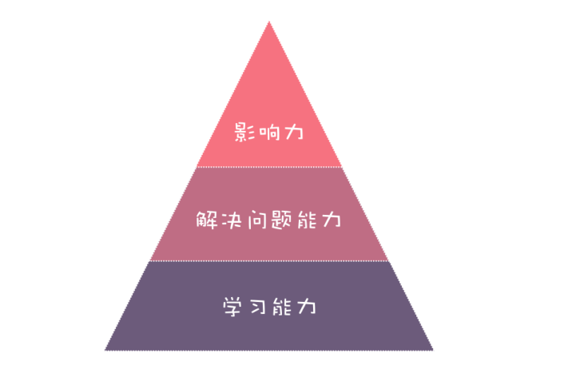

### 如何提升学习能力

首先需要在一个技术领域深耕 然后往相近的领域逐步横向拓展

### 如何提高解决问题的能力

1. 明确问题
2. 拆分和定位问题
3. 提出解决方案并总结

### 如何提升影响力

1. 在某个领域做出了足够牛的成绩
2. 做事情超出预期
3. 帮助其他人就是在帮助自己
4. 分享就是学习和打造影响力

## 自动化测试

### 有哪些自动化测试

- 单元测试
- 集成测试
- UI 测试
- 端到端测试
- 契约测试
- 组件测试

谷歌按照数据量来划分测试类型

- 小型测试

  小型测试是为了验证一个代码单元的功能，例如针对一个函数或者一个类的测试

- 中型测试

  中型测试是验证两个或多个模块应用之间的交互，通常也叫集成测试

  契约测试，这个测试最

  近出现的频度比较高，主要是针对微服务的。其实就是让微服务在测试时，不需要依赖于引

  用的外部的微服务，在本地就可以模拟运行，同时又可以保证外部微服务的接口更新时，本

  地模拟的接口（契约）也能同步更新

- 大型测试

  型测试则是从较高的层次运行，把系统作为一个整体验证。会验证系统的一个或者所有子

  系统，从前端一直到后端数据存储。大型测试也叫系统测试或者端对端测试

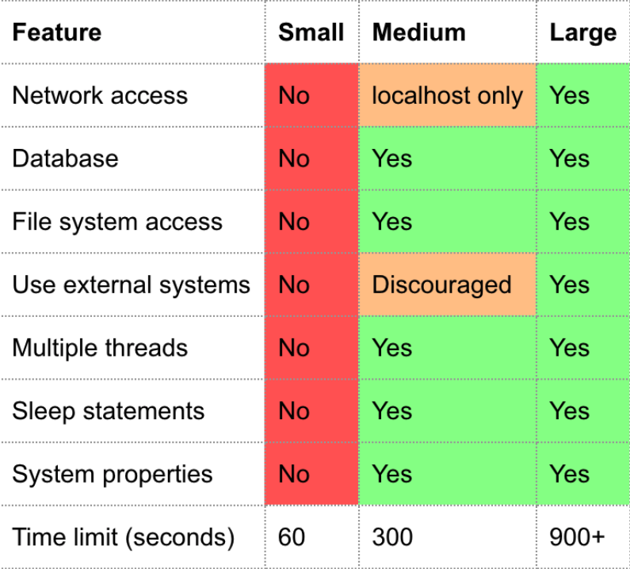

小型测试，没有外部服务的依赖，都是要模拟的；

中型测试，所有的测试几乎都不需要依赖其他服务器的资源，如果有涉及其他机器的服

务，则本地模拟，这样本机就可以完成测试；

大型测试，几乎不模拟，直接访问相关的外部服务

### 怎么写好自动化测试代码

1. 准备
2. 执行
3. 断言
4. 清理

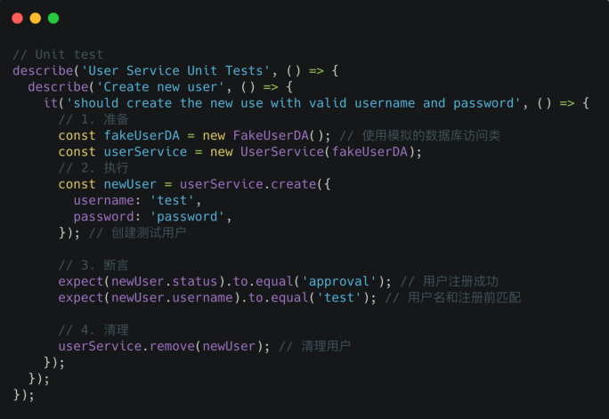

一个完整的自动化测试要包括三个部分的测试：

- 验证功能是不是正确

  例如说输入正确的用户名和密码，要能正常注册账号；

- 覆盖边界条件

  比如说如果用户名或密码为空，应该不允许注册成功；

- 异常和错误处理

  比如说使用一个已经用过的用户名，应该提示用户名被使用。

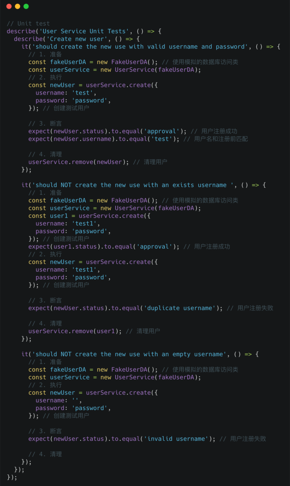

### 选择好自动化测试框架

#### web 前端

- jest

  facebook 出品

- mocha

  js 测试框架

- nighwatch

  一个 api ， 可以直接操作浏览器的自动测试框架

在提交代码前，先本地跑一遍单元测试，这个过程很快的，失败了需要继续修改；

单元测试成功后就可以提交到源代码管理中心，提交后持续集成服务会自动运行完整的自

动化测试，不仅包括小型测试，还有中型测试；

通过所有的测试后，就可以合并到主分支，如果失败，需要本地修改后再次提交，直到通

过所有的测试为止。

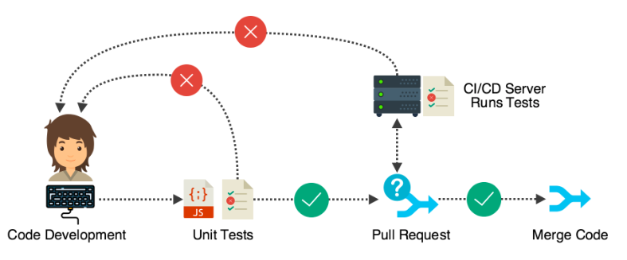

## 源代码管理工具

### 介绍

源代码管理工具也叫版本控制系统，是保存文件多个版本的一种机制

## 哪些网上托管平台

- github
- gitlab
- coding
- 码云
- 阿里云 code
- 百度效率云
- 腾讯 git 代码托管
- 华为云 codehub

### 如何用好源代码管理工具？

- 要频繁的提交

- 每次提交后要跑自动化测试

- 提交的代码要有人审查

  ```
  对于审查出来的问题，可以分成三个类型

  问题：如果对代码有不清楚的地方，可以作为问题提出，进一步澄清确认；
  建议：原来的实现没有太大问题，但是可以有不同的或者更好的实现；
  阻塞：代码有明显问题，必须要修改。
  ```

### 选择对应的开发流程

- git flow
- github flow
- gitlab flow

**github flow** 开发流程

- 有一个稳定的分支，如 master

- 每次创建新功能或者修复 Bug，必须创建一个分支。最后通过代码审查和自动化测试

  后，才能合并回稳定分支

**详细流程**

1. 创建分支
2. 提交更新
3. 创建 pr 请求合并
4. 讨论和代码审查、
5. 部署测试
6. 合并

**github 常见问题**

- 发布版本

  从 master 上创建 Tag，如 v1.0 等

- 线上版本打补丁

  ```
  如果线上发布的版本（例如 v1.0）发现 Bug，需要修复，那么基于之前的 Tag 创建一个分
  支（例如 hotfix-v1.0-xxx）出去，在分支上修复，然后提交 PR，代码审查和自动化测试通
  过后，从分支上创建一个新的 Tag （例如 v1.0.1），将新的 Tag 发布部署到生产环境，最
  后再把修改合并回 master
  ```

- 如果我经常需要打补丁，有没有比 Tag 更好的办法

  ```
  每次发布后，可以创建一个发布版本的分支，例如 release-v1.0，每次打补丁，都直接从
  发布分支 release-v1.0 而不是 master 创建新的分支（例如 hotfix-release-v1.0-xxx），
  修复后提交 PR，代码审查和自动化测试通过后，合并回分支 release-v1.0，然后基于
  release-v1.0 分支发布补丁。
  最后将合并的 PR，借助 git 的 cherry-pick 命令再同步合并回 master
  ```

## 测试相关工具

### bug 跟踪系统

- jira

- 禅道

- TAPD

- 云效

- Bugzilla 是由 Mazilla 公司提供的一款开源免费的 bug 跟踪系统。这是一款历史很悠久的

  产品

- MantisBT 是一个简单但功能强大的开源 bug 跟踪系统，可以通过各种插件来扩展其功

  能

- Redmine 是一款开源的综合性的项目管理工具，不仅可以用于 Bug 跟踪，还可以用来跟

  踪项目进度

### 自动化测试工具

- Selenium 是一个 Web 端的自动化测试工具，直接运行在浏览器中，用来模拟用户操作。

  类似的还有 WebDriverIO 和 Nightwatch.js ，支持 Javascript，API 更简单更方便

- Appium 是一个开源、跨平台的自动化测试工具，用于测试移动原生应用，支持 iOS,

  Android 系统

- Macaca 是阿里巴巴开源的一款面向多端的自动化测试工具，支持桌面端、Web、移动

  端、真实设备和模拟器

### 压力测试工具

- Apache JMeter 是一款开源的压力测试工具，纯 Java 应用程序

- LoadRunner 是惠普旗下的一款商业自动负载测试工具，可以通过录制的方式制作测试脚

  本，上手容易功能强大，可以方便的监控和分析性能测试结果

- 阿里云性能测试 PTS 阿里云性能测试 PTS 是基于云端的压力测试服务，可以模拟从全国各地域运

  营商网络发起的流量，报告真实反应用户体验情况

- WebPageTest WebPageTest 是一个可以用来测试和分析网页性能的在线工具，支持不同浏览器，

  支持 API。可参考《WebPagetest H5 性能测试工具入门详解》。、

### 安全性测试工具

- Fortify On Demand 是惠普旗下的一款安全检测工具，可以通过分析源代码、二进制程序

  或者应用程序 URL 检测程序安全漏洞

- Sqlmap 是一款开源免费的检测 Sql 注入的工具

- APPScan 是 IBM 旗下的一款漏洞扫描工具，支持网站和移动 App

### 浏览器兼容性测试工具

- Browsera 可以对不同浏览器下的布局提供报告，包括截图和 Javascript 错误

- Browslering 可以针对不同浏览器进行测试，它在虚拟机中运行真实桌面浏览器，还可以人

  工进行交互

### 测试用例管理工具

- TestRail 是 TestRail 是一个专注于管理测试用例的工具，可以用它来创建测试用例和用例

  集，跟踪测试用例的执行和生成报告

- 飞蛾 是 Coding 旗下的测试管理工具，对中文支持好，界面美观

## 安全问题

### 软件中的安全问题分类

- 恶意输入 sql 注入、xss
- 假冒身份
- 数据泄露

### 如何预防

- 需求阶段

  ```
  登录网页使用 Https 或者在传输密码时加密；
  增加图形校验码，避免恶意攻击；
  密码失败次数过多，应该锁定用户一段时间；
  记录用户登录 IP
  ```

- 设计阶段

  - 攻击面最小化

    ```
    攻击面就是指程序被用户直接访问到的部分，比如 API、网站等，这些暴露给用户的地方也
    是最可能被黑客攻击的地方。
    暴露的面越多则风险越高，攻击面最小化的设计原则，就是说尽量减少暴露黑客可能发现并
    试图利用的攻击面数量。
    举例来说，你的数据库应该关闭外网访问，避免黑客直接攻击数据库导致数据泄漏。还有像
    对于一些复杂的多网站业务系统，实行单点认证，就可以让所有业务都在一个地方登录，你
    可以在这一个地方做到做到足够安全，这样所有网站的登录都是相对安全的
    ```

  - 权限最小化

    ```
    限最小化的设计原则就是对于系统的用户、文件访问、进程运行等，都只给予其能拥有的
    最小权限，这样可以保证一个应用程序或者网站被攻击、破解，能将损害降到最低。
    举例来说，以前在部署 Asp.Net 程序的时候，运行 Asp.Net 的程序是单独的一个用户，这
    个用户所拥有的权限是只能运行程序所在目录，不能超出其目录范围，这样即使用户上传了
    恶意木马文件，那么也只能控制这一个目录，避免了进一步的损失
    ```

  - 纵深防御

    ```
    纵深防御的设计原则，指的是从不同的维度去实施安全保护措施，从而缓解被攻击的风险。
    纵深防御并不是同一个安全方案要做两遍或多遍，而是要从不同的层面、不同的角度对系统
    做出整体的解决方案
    ```

- 开发阶段

  - 编码规范中加入安全相关内容
  - 要有代码审查
  - 增加安全相关的自动化测试

- 测试阶段

  增加对安全性方面的测试

- 上线维护

  服务器进行安全设置，比如说严格限制端口，只保留必须的端口；只对少数服务器开发外

  放服务；开启操作日志；对访问目录设置最小的权限

## 版本发布

### 软件版本周期

α、β、λ 常用来表示软件测试过程中的三个阶段。

-- α 是第一阶段，一般只供内部测试使用；

-- β 是第二个阶段，已经消除了软件中大部分的不完善之处，但仍有可能还存在缺陷和漏洞，一般只提供给特定的用户群来测试使用；

-- λ 是第三个阶段，此时产品已经相当成熟，只需在个别地方再做进一步的优化处理即可上市发行。

#### 开发期

-- Alpha(α)：预览版，或者叫内部测试版；一般不向外部发布，会有很多 Bug；一般只有测试人员使用。

-- Beta(β)：测试版，或者叫公开测试版；这个阶段的版本会一直加入新的功能；在 Alpha 版之后推出。

-- RC(Release Candidate)：最终测试版本；可能成为最终产品的候选版本，如果未出现问题则可发布成为正式版本

多数开源软件会推出两个 RC 版本，最后的 RC2 则成为正式版本。

#### 完成期

-- Stable：稳定版；来自预览版本释出使用与改善而修正完成。

-- GA(General Availability)：正式发布的版本；在国外都是用 GA 来说明 release 版本的。

-- RTM(Release to Manufacturing)：给生产商的 release 版本；RTM 版本并不一定意味着创作者解决了软件所有问题；仍有可能向公众发布前更新版本。

另外一种 RTM 的称呼是 RTW（Release To Web），表示正式版本的软件发布到 Web 网站上供客户免费下载。

-- RTL(Retail)：零售版；是真正的正式版，正式上架零售版。

以 Windows 7 为例，RTM 版与零售版的版本号是一样的。

#### 其他表述

-- OEM(Original Equipment Manufacturer)：原始设备制造商；是给计算机厂商随着计算机贩卖的，也就是随机版；

只能随机器出货，不能零售。只能全新安装，不能从旧有操作系统升级。包装不像零售版精美，通常只有一面 CD 和说明书(授权书)。

-- RVL：号称是正式版，其实 RVL 根本不是版本的名称。它是中文版/英文版文档破解出来的。

-- EVAL：而流通在网络上的 EVAL 版，与“评估版”类似，功能上和零售版没有区别。

### 软件版本

> 主版本号 . 子版本号.[. 修正版本号.[构建版本号]]
>
> 1.2.1、2.0、3.0.1 build-123

其中主版本号和子版本号用来标识功能变化，小的功能变化增加子版本号，大的功能变化增

加主版本号。修正版本号则表示功能不变化的情况下修复 Bug，而构建版本号表示一次新

的构建，这个通常由编译程序自动生成

### 版本发布的规划

- 规划好要发布的功能

- 设计好发布的策略

- 一个综合性的版本发布计划

  ```
  这个发布计划，不止是项目内部成员，还需要和项目之外利益相关方，比如客户、市场运营
  人员，大家一起确定最终的发布计划
  ```

### 规范好发布流程，保障发布质量

- 保证要编译部署的是正确的版本

- 要保证版本稳定可靠

- 要在发布失败后能回滚

- 针对以上，可以采取 代码冻结、Bug 分级、回归测试

### 大厂发布流程

- 在发布之前要做代码冻结

  ```
  什么是代码冻结呢？就是在发布之前，对于要发布的版本，在源代码管理工具中，专门创建
  一个 release 分支，然后对于这个分支的代码，冻结功能的修改，不接受新功能的增加，甚
  至重要性不高的 Bug 都不修改，只修复重要的 Bug
  ```

- 对代码冻结后发现的 Bug 要分级

  ```
  在代码冻结后，可能还存在一些 Bug，测试的过程中也会新增一些 Bug。代码冻结的原则
  就是尽可能减少代码的修改，避免引起不稳定。所以对于这些 Bug，要有一个简单的分
  级：是否在发布前修改，还是留在发布后再修改
  ```

- 每次修复 Bug 后，发布新的候选版本

  ```
  进入代码冻结后，开发人员还需要对一些 Bug 进行修复，每一次修复完 Bug 后，就要生成
  一个新的候选发布版本，比如说 1.1 RC1、1.1 RC2
  ```

- 每次部署新的候选发布版本后，要做回归测试

  ```
  在每次开发人员部署新的候选发布版本到测试环境后，还需要做一次回归测试。也就是说在
  Bug 修复完，对主要流程要重新测试一遍，同时还要对之前确认过的 Bug 再确认一遍，以
  确保 Bug 确实修复了，并且没有引入新的 Bug
  ```

- 申请上线发布

  ```
  上线发布是一件很严谨的事，所以在正式上线发布前，通常还需要有一个申请和审批的流
  程。审批的主要目的是要有人或者有部门统筹对所有的上线发布有一个全面的了解和控制，
  避免上线过于随意导致问题，避免和其他部门的上线冲突
  ```

- 部署发布

  ```
  如果已经实现了自动化，部署发布应该是非常简单的一步。如果还没有自动化部署发布，也
  需要事先将详细的操作步骤写下来，避免部署发布时发生纰漏，这样在实际部署发布时，按
  照事先写好的步骤操作就不容易出现错误
  ```

- 上线后的测试

  ```
  项目上线后，测试人员需要马上对已经上线的版本做一个主要功能的测试，以确保线上运行
  正常。如果做好了数据监控，还同时要对一些关键数据进行监控，例如服务器 CPU 利用
  率、内存占用、服务出错率等数据。
  如果万一发现版本上线后出现问题，需要考虑按照事先准备好的回滚方案进行回滚操作，尽
  量将损失降到最低。通常不到万不得已，不建议马上对问题打补丁进行修复。因为哪怕很小
  的代码修改，都可能会引入新的 Bug。而重新做一遍回归测试，耗时会比较
  ```

## DevOps

DevOps 可以理解为一种开发（Development）和运维（Operations）一起紧密协作的工作方式，从而

可以更快更可靠的构建、测试和发布软件

### DevOps 作用

1. 整个软件的构建、测试和发布过程高度自动化
2. 信息更加透明和易于测量
   1. 通过日志和工具可以直观看到开发到部署需要多少时间，哪个环节可以改进？
   2. 当前服务运行情况如何，每分钟访问数多少，API 出错率多少？
   3. 当前用户数多少，有多少新增用户？
3. 培养跨职能协作的文化

### DevOps 工程师到底要做什么事情

1. devOps 工程师要帮助团队建立基于持续集成和持续交付工作流程

2. 要建立一套基于日志的监控报警的系统，以及故障响应的流程

3. 要构建基于云计算和虚拟化技术的基础设施

4. 要形成 DevOps 的文化

   DevOps 最核心本质的就是工作方式和协作的文化，而这样的文化需要有人引领，一点点

   去形成

## 遇到线上障碍，该如何处理

### 处理方法

1. 评估影响范围
2. 试图重现问题
3. 临时方案和终极方案
4. 风险评估及持续优化

### 大厂线上故障处理机制

1. 故障报警和轮值机制

   ```
   要做到最快速度处理线上故障，关键就是要让正确人的第一时间就可以去响应。正确的人就
   是对故障服务最熟悉的人，通常就是这个服务的开发人员。
   但让所有开发人员 7x24 小时随时待命也不现实，所以一般大厂会采用轮值的机制，比如说对于每个服务，每周要安排两个人值班，一个是主要的，出现故障第一时间响应；另一个人准备着，以防万一联系不上主要值班人员时可以顶替值班。
   大厂都有一个报警系统，值班的那一周，值班人员手机要 24 小时开机，笔记本要随身携
   带，如果负责的服务出现故障，那么会在第一时间被报警系统呼叫。如果 15 分钟没有人响
   应，就会层层往上传递，值班开发人员没响应就呼叫经理，再是总监，VP，直到 CEO。
   这套机制虽然被很多开发人员诟病良多，毕竟值班期间要随时待命，但确实是一套非常简单
   有效的机制，让最熟悉服务的开发人员第一时间去处理，可以帮助线上系统以最快的速度恢
   复服务
   ```

2. 实战演习

   ```
   如果日常对这些方案有演习，去实际测试一下，就不至于这么狼狈。实战演习就是频繁地对
   故障进行演练，来测试平时做的这些方案是不是真的可行，这样遇到真正的故障，才不至于
   手忙脚乱不知道如何应对。
   其中最有名的就是 Netflix 的混乱猴子军团，Netflix 在亚马逊云上建立了一个叫做 ChaosMonkey（混乱猴子）的系统，这些猴子会在工作日期间随机杀死一些服务，制造混乱，来测试生产环境下的稳定性。也有人把这样的实战演习叫“混沌工程”
   ```

3. 日志记录和分析工具

   ```
   对于软件来说，线上出现问题，分析日志记录是最简单有效的定位问题方式。这就要求平时
   在开发的时候，就要注意对关键日志信息的记录，同时还要搭建像 ELK 或 Splunk 这样的日志分析系统，方便查询日志
   举个例子：一个 API 请求，出现了随机无法访问的故障，而这个 API 可能会经过 5-10 个服务，怎么快速定位是哪一个服务出现问题？
   一个好的实践是这样的：
   对于每一个请求，都会分配一个唯一的请求编号（requestId），在经过每一个服务的时
   候，都带上这个请求编号，每个服务都把这个请求的输入和输出记录下来，输入的 url 参数是什么？http 的 header 是什么？输出的状态码是什么，输出内容的大小是什么？如果出错，异常信息包括错误堆栈是什么？
   当出现故障的时候，找到一个有问题的 requestId，根据这个 requestId 去日志分析系统查询相关的所有服务的日志，这样马上就可以看出来哪一个服务返回的结果是有问题的。当然还有一些其他好的实践，例如说新功能上线时，灰度发布的策略。通过开关控制，先让一小部分用户使用，如果出现故障，马上关闭开关，避免影响
   ```

## 日志管理

### 什么是日志管理

日志就是操作系统和应用软件自动生成的事件说明或者消息记录，包含了时间、日志信息

### 大厂的日志管理系统的架构是什么样子

### ELK

ELK 是 Elasticsearch+Logstash+Kibana 的缩写。

ElasticSearch 是一套搜索框架，提供了方便的接口，可以方便地做全文检

索，可以用来对日志进行检索。

Logstash 是一个数据收集工具，可以用来收集日志数据。

Kibana 是一套可以和 ElasticSearch 交互的界面，通过 Kibana 可以方便的

检索 ElasticSearch 内的所有数据，还可以用图形化的方式展示数据结果。

这套架构有几个重要的模块：**日志采集和解析**、**存储和搜索**、**结果可视化**、**监控和报警**

### 日志管理系统

1. Splunk 是一套商业的日志管理系统，搜索功能非常强大，操作方便，就目前来说，要比

   ELK 好用，但价钱很高

2. Grafana 是一套开源的数据监测和可视化工具，可以和 ELK 或 Splunk 配合使用，展示效

   果比 Kibana 要更好。同时可以支持自动报警功能

3. Wavefront 是 VMware 旗下的一款商业的图形化监控和分析工具，可以从 ELK 或 Splunk

   等数据源收集数据，在此基础上分析应用的性能瓶颈所在，排除故障。也支持自动报警

4. PagerDuty 是一套报警服务，不仅可以和手机、邮件、Slack 等方便的集成，还可以和企

   业的轮值安排结合，按照排班顺序呼叫当值人员

## 项目复盘

参考联想公司的四个步骤

1. 回顾项目目标
2. 评估项目结果
3. 分析原因
4. 总结规律落实行动
